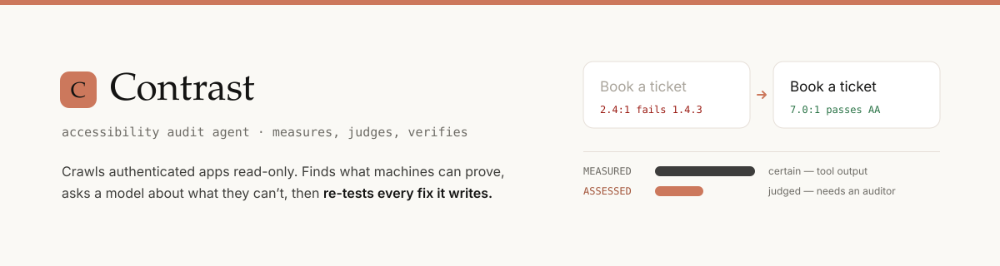
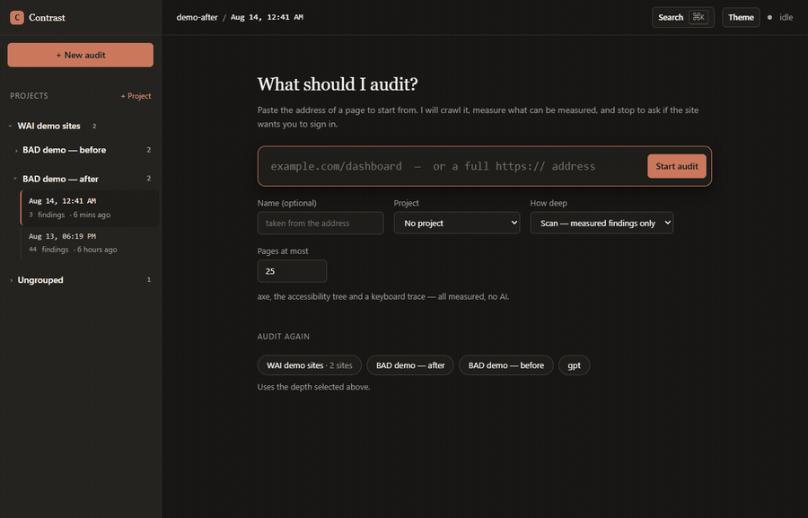
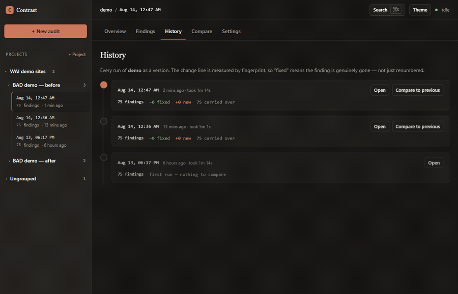
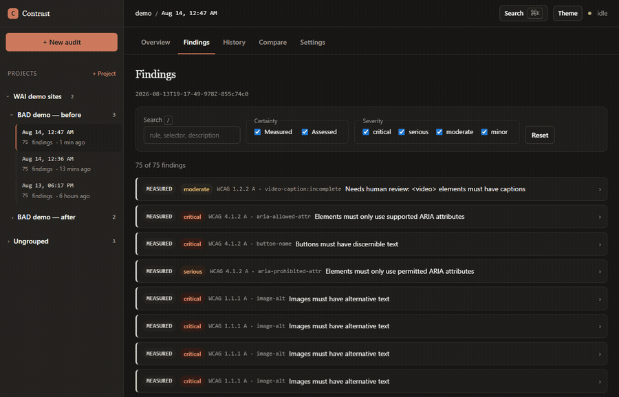
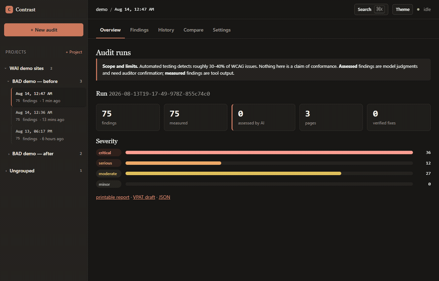
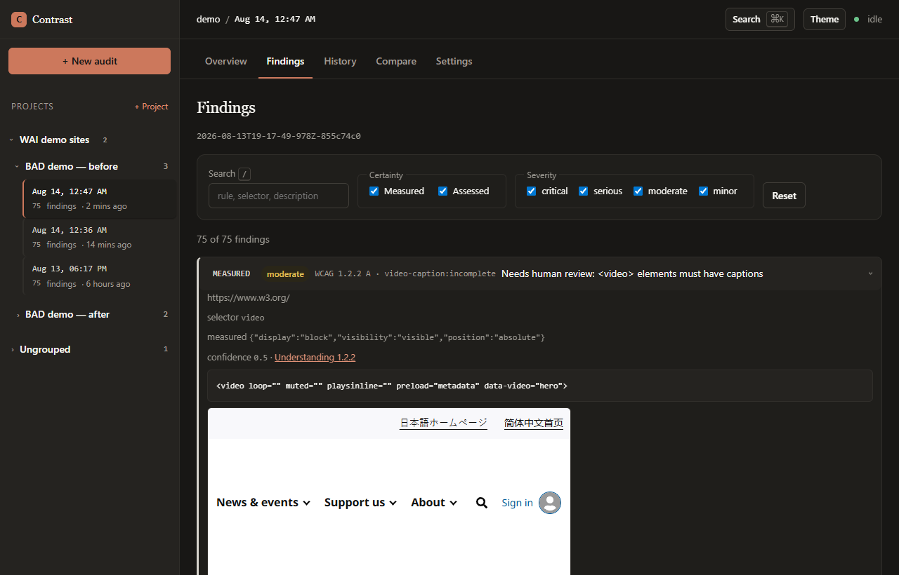
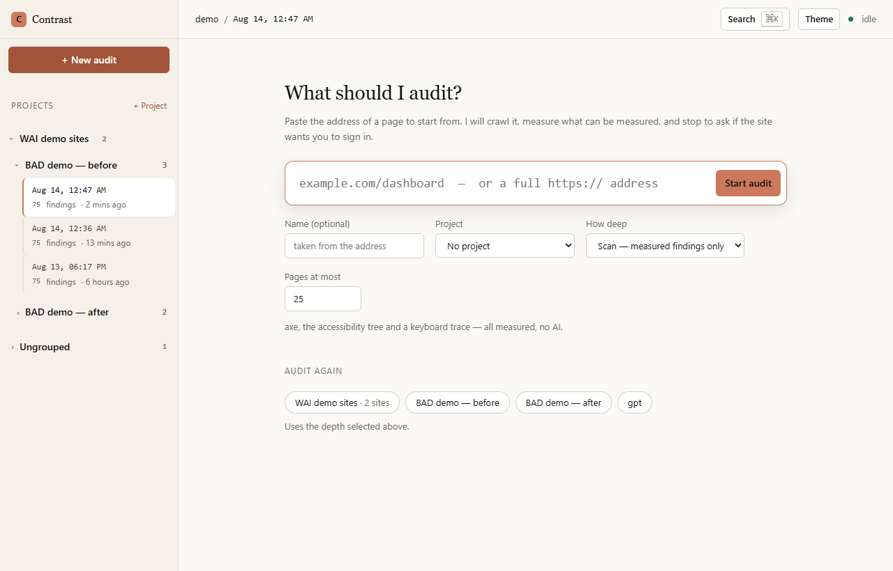
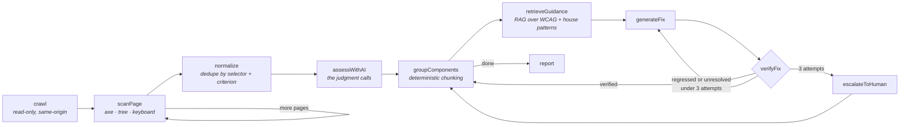
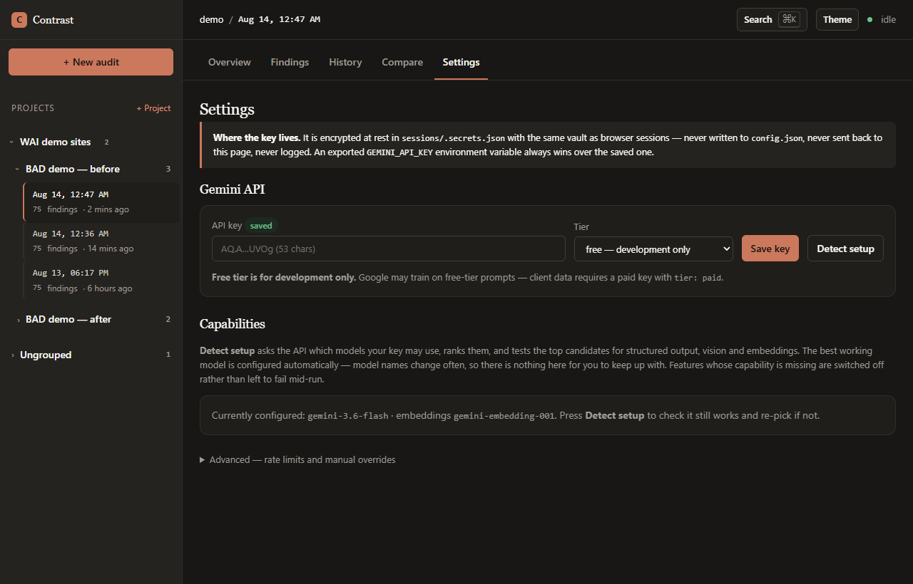
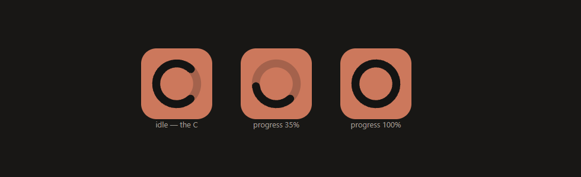

<picture>
  <source media="(prefers-color-scheme: dark)" srcset="docs/banner-dark.svg">
  
</picture>

<p align="center">
  <code>Node 22+</code> · <code>no build step</code> · <code>no framework</code> ·
  <code>68 tests</code> · <code>0 axe violations in its own UI</code>
</p>

<p align="center"><sub>
  Source-available — viewing is open, using it isn't. See <a href="LICENSE">LICENSE</a>.
</sub></p>

An AI-assisted accessibility auditing tool for **teams of human auditors**. It crawls a site —
including the parts behind a login — measures everything a machine can prove, asks a model about
the things machines are bad at, writes remediation code, and then **re-tests every fix in a fresh
browser before daring to call it fixed**.

It is a capacity multiplier, not a replacement. It exists so that auditors spend their hours on
judgment calls only humans can make.

> [!WARNING]
> **Automated testing catches roughly 30–40% of WCAG issues.** Nothing this tool produces is a
> claim of conformance. Findings it *measured* and findings it *assessed with a model* are shown
> differently everywhere, and a fix that could not be verified is labelled a suggestion. The
> report states its own limits on the page, not in a footnote.

---

## Quickstart

```bash
npm install
npm run ui           # → http://localhost:4321
```

Paste an address. That is the whole setup — you never edit a config file to add a site.



For the AI layer, open **Settings**, paste a Gemini key and press **Detect setup** — it works out
which model to use on its own. Everything works without a key; you just get the measured half.

---

## What you get

| | |
|---|---|
| **Measured** | axe-core, the Chrome accessibility tree, a real keyboard trace, computed styles, per-element screenshots. Optionally Lighthouse. |
| **Assessed** | Alt-text *quality* (machines catch missing alt; the gap is useless alt), link and button text, heading semantics, form labels and errors, reading order. |
| **Fixed** | Corrected HTML/ARIA/CSS, grounded in WCAG text and your own house patterns. |
| **Verified** | Every fix injected into a fresh page and re-scanned: resolved, and **no new violations**. |
| **Reported** | JSON, a printable HTML report, run-to-run diffs, and a VPAT/ACR first draft. |

---

## The interface

Named **Contrast**, because that is what the tool measures and what its own interface has to get
right. Vanilla JS and CSS — no framework, no build step. It audits itself: `npm run audit:ui`
reports **zero axe violations across six views in both themes**, and that is a build condition.

### An audit is a version, not a report

Sites accumulate audits the way a repo accumulates commits, so the sidebar is a version tree and
**History** is a git-log-style rail. The change line between runs is measured by fingerprint, so
"fixed" means the finding is genuinely gone — not renumbered.



### Findings you can actually work through

Filter by certainty and severity, search, expand for the markup, the measured values, the
screenshot and the proposed fix.



### Organise it like a workspace

Right-click any project, site or audit: rename, pin, move to a project, delete. `⌘K` jumps
anywhere. Everything is keyboard-operable, because a right-click-only feature in an accessibility
tool would be indefensible.



<table>
<tr>
<td width="50%"></td>
<td width="50%"></td>
</tr>
<tr>
<td align="center"><sub>Both themes are authored, not inverted</sub></td>
<td align="center"><sub>Cream canvas, warm ink, coral accent</sub></td>
</tr>
</table>

---

## Sign-ins are an interruption, not a prerequisite

There is no "log in first" step to remember. The pipeline detects a sign-in wall itself — at the
start, or when a session expires halfway through a crawl — **stops**, shows you the page in the
embedded browser, and asks. You sign in *in the panel*; the run resumes where it stopped.

Nothing is scanned while it waits, so a login wall can never end up in a report as if it were the
client's app. **Credentials are never stored** — only the resulting cookies and web storage,
encrypted at rest with AES-256-GCM.

If signing in doesn't clear the check twice running, it gives up and tells you to look at
`loggedOutPattern` rather than asking forever.

---

## How it works



Phases 1–6 are plain functions. Phase 7 wraps *orchestration only* in a LangGraph state graph —
Puppeteer, axe and Lighthouse are called directly, because they are deterministic functions with
no reasoning in them and wrapping them in tool abstractions would only hide errors.

| Phase | Where | What |
|---|---|---|
| 1 | [`src/browser/`](src/browser/) | manual login, encrypted session reuse, **read-only request guard**, robots-aware BFS crawler |
| 2 | [`src/scan/`](src/scan/) | collectors + the normalizer that dedupes axe against Lighthouse |
| 3 | [`src/ai/`](src/ai/) | five judgment tasks + remediation, grounded by RAG over `knowledge/` |
| 4 | [`src/ai/limiter.js`](src/ai/limiter.js) | one sequential queue, token bucket, daily cap, backoff with jitter, content-hash cache |
| 5 | [`src/verify/`](src/verify/) | inject → re-scan → resolved **and** no regressions |
| 6 | [`src/report/`](src/report/) | JSON, HTML, diff, VPAT draft |
| 7 | [`src/graph/`](src/graph/) | the state graph, SQLite checkpointing, `interrupt()` for the human |

### Decisions worth knowing

- **No RAG over findings.** They are structured and complete, so they are filtered
  deterministically. Vector search over them could silently miss one, which is unacceptable in a
  compliance tool. RAG is used *only* over the knowledge base.
- **WCAG lookup is exact, not embedded.** Criterion `1.4.3` is found by its number; embeddings
  only find the closest *pattern* or past house fix.
- **Rule → WCAG mapping comes from axe's own metadata**, never a hand-maintained table. That is
  what makes cross-tool dedupe meaningful.
- **Dedupe never merges findings that lack a selector or a criterion.** Showing an issue twice is
  better than dropping it.
- **axe cannot verify a judgment call.** Fixes for AI findings are marked `unverified` and sent to
  review rather than retried three times and declared failures.

---

## Safety

These are not configurable.

- **Read-only.** Every request is intercepted; anything that is not GET/HEAD is aborted, plus a
  URL denylist (`/logout`, `/delete`, …). The manual login runs on a separate *unguarded* page —
  otherwise the auditor's own credential POST would be blocked.
- **No credentials stored.** A human signs in; only the resulting session is persisted, encrypted.
- **No bot-protection bypass.** If a site answers with a challenge (Cloudflare's "Just a moment…",
  a bare 403), the run **stops and scans nothing** — reporting a block page's accessibility as the
  client's would be worse than failing. The remedy is a real browser window
  (`"browser": { "headless": false }` on that client), where you are an ordinary visitor.
- **Free Gemini tier is for development only.** Google may train on free-tier prompts. Set
  `ai.tier: "paid"` before any client data goes near it; the tool warns on every run until you do.
- **The dashboard is fenced.** It binds `127.0.0.1` only, mutations need POST plus a header no
  cross-origin form can set, and only four commands can ever spawn — as an argv array, never a shell.

---

## CLI

Every dashboard button runs one of these as a child process, so the two cannot drift apart.

```bash
node src/cli.js run <client|group> [--scope=scan|assess|full]   # the one you want
node src/cli.js ui [port]                                       # the dashboard
node src/cli.js login  <client>                                 # headed manual login
node src/cli.js scan   <client>                                 # deterministic scan only
node src/cli.js assess <client> <runId>                         # AI pass over a scanned run
node src/cli.js audit  <client>                                 # the full LangGraph pipeline
node src/cli.js report <runId>                                  # report.json + report.html
node src/cli.js vpat   <runId>                                  # VPAT/ACR first draft
node src/cli.js diff   <baseRunId> <headRunId>                  # fixed / new / still broken
node src/cli.js runs                                            # list runs
```

---

## Configuration

Everything lives in [`config.json`](config.json), which stays the source of truth and stays
hand-editable — the dashboard writes to it atomically and keeps a `.bak`.

<details>
<summary><b>Budgets — nothing runs forever</b></summary>

| Budget | Default | Key |
|---|---|---|
| One page, everything | 120s | `crawl.pageTimeoutMs` |
| Lighthouse alone | 75s | `scan.lighthouseOptions.timeoutMs` |
| axe alone | 60s | `scan.axeTimeoutMs` |
| Keyboard trace | 20s / 40 stops | `scan.keyboardTimeoutMs`, `scan.maxTabs` |
| Element screenshots | 45s / 60 shots | `scan.enrichBudgetMs`, `scan.maxElementShots` |
| Silence before the dashboard says so | 180s | `ui.stallSeconds` |

A page that overruns is recorded with its timeout as the error and the crawl moves on.
</details>

<details>
<summary><b>Gemini — you never choose a model</b></summary>

Model names churn: `gemini-2.5-flash` is still listed by the API while returning *"no longer
available to new users"* on first call. **Listing is not proof — only a real call is.**

**Detect setup** asks the API which models your key may use, ranks them (newest major version,
then `flash` for a pipeline of tens of thousands of small calls, then stable over preview), probes
the top candidates for structured JSON, inline images and embeddings, and writes the winner to
config. Missing capabilities switch features *off* rather than failing mid-run: no vision means
alt-text quality is skipped, no embedding model means the knowledge base falls back to keyword
retrieval.


</details>

<details>
<summary><b>Clients and projects</b></summary>

```jsonc
"groups": {
  "acme": { "label": "Acme estate", "clients": ["acme-www", "acme-app"] }
},
"clients": {
  "acme-app": {
    "label": "Acme — app",
    "seedUrl": "https://app.acme.com/dashboard",
    "requiresLogin": "auto",          // auto | true | false
    "loggedOutPattern": "(/login|/sso)",
    "browser": { "headless": false }, // for sites behind bot protection
    "crawl": { "maxPages": 200, "allowlist": ["/app"], "concurrency": 3 }
  }
}
```
Selecting a **project** audits every site in it, one after another, in a single job.
</details>

<details>
<summary><b>Knowledge base</b></summary>

`knowledge/` seeds the grounding corpus: every WCAG 2.2 criterion with remediation notes on the
machine-detectable ones, ARIA APG pattern summaries, and `house-patterns/` — the fixes your team
stands behind. Drop more `.md` in and it is indexed on the next run; delete
`knowledge/.embeddings.json` to force a re-embed.
</details>

---

## Design system

[`DESIGN.md`](DESIGN.md) documents **Contrast** in full. The short version:

- Warm neutrals, not the blue-grey every dev tool uses. Cream `#faf9f5`, ink `#141413`, coral
  `#cc785c`, warm-dark `#181715`.
- **Every colour pair is measured.** Coral fails as body text on cream at 3.1:1, so it is used for
  fills and rails only, with a darkened `#a25439` wherever it carries words. Primary buttons are
  coral with *ink* text (5.7:1), never white (3.3:1).
- **Monospace is semantic.** Machine identifiers — run ids, selectors, rules, WCAG numbers — are
  mono. Human writing is not. That one rule does most of the hierarchy work in a dense list.
- **Motion may explain, never announce.** `prefers-reduced-motion` collapses every animation to a
  1µs no-op with values rendered final — checked in the test suite, not assumed.
- **The C is the loader.** One SVG ring, three states: a static C at rest, a sweeping gap while
  working, and — once the page budget is known — a ring that *fills* to `3 of 3 pages scanned`.
  <br><br>
  A spinner that spins forever is decoration; a ring that fills is a progress report. The same
  mark is the spinner on any pending button and the empty-state watermark, and the count is
  announced to screen readers, because a ring is not information if you cannot see it.

---

## Testing

```bash
npm test          # 68 tests
npm run audit:ui  # the tool audits its own interface
```

Tests concentrate where silent bugs hide: the normalizer and its dedupe, the rate limiter (virtual
clock — no real waiting), model ranking, robots parsing, session encryption, the timeout helper,
the CSRF fence and command allowlist, and the fix-verification loop **against a real browser**.

---

## Field notes

Things this tool learned the hard way, kept here because they will bite the next person.

- **`@axe-core/puppeteer` dies on paths with spaces.** From ESM it resolves `axe-core` through a
  double-encoded file URL. Pass `axe.source` explicitly.
- **axe needs `readyState === 'complete'`.** The crawler only waits for DOMContentLoaded, so a
  scan silently returned zero violations on a page full of them.
- **Entrance animations invent contrast failures.** axe measured half-transparent text mid-fade
  and reported 19 violations that did not exist. Finite animations are now settled first.
- **A backgrounded headed Chrome stops painting**, which silently kills a CDP screencast. Jobs run
  headless so the browser lives in the app's own panel.
- **Lighthouse's accessibility category *is* axe.** It cost 25–46s per page for no unique
  findings — over 90% of a real audit's runtime. Off by default.
- **`[hidden]` loses to any `display:` on a class**, turning a hidden overlay into an invisible
  sheet that eats every click.

---

## Limits

- Automated coverage is 30–40% of WCAG. The rest is human work, and the report says so.
- The VPAT output is a **first draft**. Criteria with no automated coverage are marked
  *Not Evaluated*, never *Supports*.
- Keyboard focus detection sees `outline` and `box-shadow` only; a focus style built from
  background-colour reads as a false positive, which is why it ships at confidence 0.9.
- The graph crawls and then scans, loading each page twice — bought deliberately, so a long audit
  is resumable from a checkpoint.

---

## License

Source-available, not open source. The code is here to read — see [LICENSE](LICENSE) — but
running, deploying, or redistributing it requires the copyright holder's permission, which
extends to anyone explicitly given access to run their own copy (teammates, invited
collaborators). Opening a pull request is welcome; standing up your own deployment of it isn't,
without asking first.
